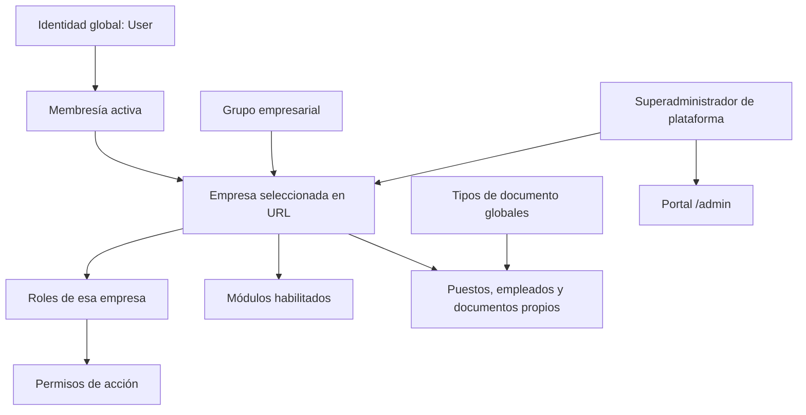

# Pixel Perfect: arquitectura, auditoría y desarrollo multiempresa

Fecha de revisión: 10 de septiembre de 2026. Alcance: estado del directorio de trabajo, incluidos cambios sin commit; no solamente `HEAD`.

## 1. Resultado de la revisión

**El núcleo multiempresa está implementado y las pruebas revisadas pasan. El PLAN_MULTIEMPRESA completo todavía no está terminado ni equivale a un SaaS comercial listo para operar.**

`PLAN_MULTIEMPRESA.md` identifica la fase 6 como última cerrada, la fase 7 como parcial, la fase 8 como preparación técnica y la fase 9 como pendiente. Se encontraron además problemas dentro de la implementación actual que conviene resolver antes de ampliar operaciones.

Esta revisión no cambió código de negocio, dependencias, migraciones ni datos reales. Se generó esta guía, se regeneraron artefactos mediante los comandos habituales y se ejecutaron pruebas en SQLite en memoria. No se ejecutó `migrate`, `migrate:fresh` ni `db:seed` contra la base de la aplicación.

### Hallazgos prioritarios

#### P1 — Webhook Stripe registrado y sin firma obligatoria cuando falta secreto

Evidencia: `app/Providers/AppServiceProvider.php:36`, `config/cashier.php`, `vendor/laravel/cashier/src/CashierServiceProvider.php:102` y `vendor/laravel/cashier/src/Http/Controllers/WebhookController.php:29`.

Cashier registra automáticamente `POST /stripe/webhook`. Su controlador añade `VerifyWebhookSignature` únicamente cuando `cashier.webhook.secret` tiene valor. `php artisan route:list --path=stripe -vv` confirmó la ruta sin ese middleware en el entorno revisado. La afirmación del plan «no existen webhooks activos» no describe las rutas realmente expuestas.

Prueba aislada: con secreto nulo, empresa ficticia con `stripe_id` y petición sin firma `customer.subscription.created`, el endpoint devolvió 200 y creó una fila en `subscriptions`. No se contactó Stripe ni se realizó un cobro. Actualmente eso no activa el estado empresarial, porque la integración comercial aún no existe; sí permite falsificar estado local de suscripción cuando existe un cliente Stripe asociado.

Corrección propuesta: deshabilitar explícitamente las rutas Cashier durante esta fase preparatoria. Al habilitar cobros, exigir firma, fallar de forma cerrada si falta secreto, comprobar idempotencia y probar eventos duplicados, inválidos y desordenados. No editar archivos de `vendor`.

#### P1 — Se puede eliminar el último superadministrador de plataforma

Evidencia: `app/Http/Controllers/Settings/ProfileController.php:82` y `app/Actions/Users/EnsureAdministratorRemains.php:43`.

La eliminación de perfil protege administradores de cada empresa, pero no verifica si quedará alguna identidad con `es_superadministrador_plataforma = true`. Prueba aislada con un único superadministrador sin rol empresarial: eliminó su cuenta con contraseña válida y quedaron cero superadministradores. Este estado es válido hoy porque el acceso de plataforma no requiere membresía.

Impacto: empresas pueden seguir funcionando mientras la administración de plataforma queda sin acceso normal. Corrección propuesta: proteger también la última identidad de plataforma dentro de la transacción y cubrir solicitudes concurrentes. Conservar, adicionalmente, la protección por empresa existente.

#### P2 — Auditoría incompleta de roles y membresías

Evidencia: `app/Http/Controllers/UserController.php:174`, `:207`, `:208`, `app/Http/Controllers/RoleController.php`, `app/Models/Role.php` y `app/Models/MembresiaEmpresa.php`.

`syncRoles()` y la eliminación de membresía no producen una actividad empresarial explícita. Role y MembresiaEmpresa no implementan `LogsActivity`; tampoco se encontró un observer/listener que complete ese registro. El log del modelo User cubre identidad, no cambios de sus relaciones.

Prueba aislada: asignar rol y retirar al usuario de una empresa modificó los datos correctamente sin incrementar `activity_log`. No se puede reconstruir desde esa bitácora quién cambió los accesos ni en qué empresa. También falta auditoría explícita del CRUD de roles.

Corrección propuesta: registrar actor, empresa, usuario/rol afectado y valores anteriores/nuevos desde Actions transaccionales. Mantener las actividades de identidad global diferenciadas de las operaciones empresariales. No incluir contraseñas, secretos ni documentos completos.

#### P2 — Exportaciones de usuarios y roles aún exclusivas de Pixel Perfect

Evidencia: `resources/js/pages/users/index.tsx:163`, `resources/js/pages/roles/index.tsx:142`, `app/Http/Middleware/EstablecerEmpresaInicial.php` y `routes/web.php`.

Ambas pantallas muestran exportar solamente cuando el slug es `pixel-perfect`. La ruta genérica `reportes.exportar` establece siempre la empresa inicial. Los reportes ya consultan por contexto empresarial, pero no tienen endpoints empresariales equivalentes a los de puestos y empleados.

Es una limitación explícita de compatibilidad, no una fuga demostrada: las pruebas existentes comprueban que un usuario de otra empresa no utiliza ese endpoint. Para ofrecer paridad funcional, agregar rutas con empresa, middleware de módulo, Wayfinder y pruebas A/B; después retirar la condición del slug en ambas pantallas.

#### P2 — Crear empresa pierde filtros y página del listado

Evidencia: `app/Http/Controllers/Admin/EmpresaController.php:125`.

El alta retorna directamente a `platform.empresas.index`, sin usar `redirectToResourceIndex()` ni una lista permitida de parámetros. Se pierde contexto de búsqueda, estado, grupo y paginación. La prueba multipágina del listado no comprueba este retorno después de crear.

Corrección propuesta: aplicar el patrón existente de redirección contextual y probar el ciclo completo de alta desde un listado filtrado.

### Pendientes de producto, distintos de los defectos anteriores

| Área                             | Estado real                                                | Trabajo restante                                                            |
| -------------------------------- | ---------------------------------------------------------- | --------------------------------------------------------------------------- |
| Empresas, grupos y contexto      | Implementado; casos revisados pasan                        | Operación y edición comercial completas                                     |
| Membresías y roles empresariales | Implementado para alta de identidad nueva y retiro         | Incorporar identidad existente, invitaciones y administración de suspensión |
| Puestos y salarios               | Aislamiento implementado                                   | Mantener pruebas cruzadas en futuras extensiones                            |
| Empleados y archivos             | Aislamiento implementado                                   | Verificar migración real, operación y recuperación                          |
| Tipos de documento               | Globales, administrados por plataforma                     | Extensiones grupales/empresariales sólo si se acuerdan                      |
| Habilitación de módulos          | Manual por empresa                                         | Matriz plan-módulo y precedencia comercial                                  |
| Planes                           | Catálogo global en tabla `plans`                           | Asignación a empresa, vínculo con precios Stripe y cuotas efectivas         |
| Stripe/Cashier                   | Empresa facturable y tablas; rutas del paquete registradas | Checkout, cobros, firmas obligatorias, eventos, reintentos y transiciones   |
| Ciclo comercial                  | Estados persistidos y control de acceso                    | Automatización por impago, gracia, retención y reactivación                 |
| Portal operativo                 | Listado/alta de empresas y edición de módulos              | Detalle, cambios de estado, consumo, auditoría propia, soporte y métricas   |

No hay cuota efectiva por guardar `limite_usuarios`; `modulos_incluidos` es texto descriptivo. Cambiar el precio o archivar un plan no modifica automáticamente acceso empresarial ni una suscripción Stripe.

## 2. Qué arquitectura tiene el proyecto

Es un monolito Laravel 13 con PHP 8.3, Inertia v3, React 19, Tailwind CSS 4 y Wayfinder. Spatie Permission administra roles y permisos; Spatie Activitylog registra las operaciones instrumentadas. Fortify gestiona autenticación, recuperación, verificación y 2FA. Cashier está configurado para facturar empresas.

Se usa una base compartida con separación por filas. **No hay un scope global universal que añada empresa automáticamente a cualquier consulta.** Cada entrada, consulta, relación y mutación debe conservar su frontera explícita. Una llamada nueva a `Empleado::query()->get()` sin restricción empresarial puede romper ese contrato.

### Propiedad de los datos

| Propiedad              | Modelos/datos                                                               | Regla                                                                            |
| ---------------------- | --------------------------------------------------------------------------- | -------------------------------------------------------------------------------- |
| Global                 | User, permisos, Modulo, Plan, TipoDocumentoEmpleado                         | No duplicar por empresa                                                          |
| Empresarial            | MembresiaEmpresa, Role, Puesto, Empleado, EmpleadoDocumento, empresa_modulo | Limitar por empresa y relaciones válidas                                         |
| Estructura corporativa | GrupoEmpresarial y relación con Empresa                                     | Agrupa empresas; no concede acceso compartido                                    |
| Auditoría              | activity_log                                                                | empresa_id para actividades empresariales instrumentadas; nullable para globales |

Una persona puede tener una identidad User compartida y expedientes Empleado independientes. El correo de User es único globalmente. Nombre de usuario, correo, CURP, RFC y NSS de Empleado tienen unicidad dentro de su empresa.

Puestos y salarios **no se comparten entre empresas**, aunque pertenezcan al mismo grupo. Actualmente no existe un catálogo grupal implementado que deba copiarse como referencia.

### Mapa del código

| Ubicación                                             | Responsabilidad                                                    |
| ----------------------------------------------------- | ------------------------------------------------------------------ |
| `routes/web.php`                                      | Separación entre plataforma, empresa y rutas heredadas             |
| `bootstrap/app.php`                                   | Alias y orden de middleware                                        |
| `app/Services/Empresas/EmpresaContext.php`            | Empresa y membresía del request; exige contexto cuando corresponde |
| `app/Http/Middleware/InicializarContextoPermisos.php` | Limpieza del contexto y relaciones de permisos por request         |
| `app/Http/Middleware/EstablecerEmpresaActiva.php`     | Resolver slug, comprobar acceso y establecer team Spatie           |
| `app/Http/Middleware/EnsureModuleEnabled.php`         | Bloquear módulo no habilitado                                      |
| `app/Actions/Empresas/`                               | Creación, roles predeterminados, habilitación y overrides          |
| `app/Actions/Empleados/`                              | Mutaciones complejas, transacciones y archivos                     |
| `app/Services/Empleados/EmpleadoPrivatePath.php`      | Validación de prefijo de archivo                                   |
| `app/Services/Reportes/`                              | Definiciones, validación, autorización y generación PDF/Excel      |
| `resources/js/components/app-navigation.ts`           | Navegación condicionada por plataforma, módulo y permiso           |
| `resources/js/components/empresa-switcher.tsx`        | Selección de empresa                                               |
| `resources/js/features/`                              | Partes específicas de módulos                                      |
| `tests/Feature/Multiempresa/`                         | Pruebas del contrato de aislamiento y acceso                       |

## 3. Cómo funciona actualmente

### Entrada y cambio de empresa

1. El usuario inicia sesión y completa verificación cuando la ruta la exige.
2. `/dashboard` sirve como entrada general. El selector muestra empresas según sus membresías; plataforma puede ver todas.
3. Al visitar `/app/{empresa:slug}`, el middleware resuelve la empresa antes de los bindings hijos.
4. Un usuario normal necesita membresía activa y empresa con acceso permitido. Empresa ajena responde 404; membresía suspendida o empresa bloqueada responde 403.
5. `EmpresaContext` recibe empresa/membresía y Spatie recibe `setPermissionsTeamId($empresa->id)`. Se limpian las relaciones de permisos del usuario para evitar reutilizarlas entre empresas.
6. El middleware de módulo y las autorizaciones del endpoint deciden acceso a cada operación. Scoped bindings impiden resolver registros hijos de otro tenant.
7. Inertia comparte `empresas.activa`, `empresas.disponibles`, permisos y módulos habilitados. Wayfinder conserva la empresa en enlaces y formularios.

Para usuarios normales el contrato exige empresa accesible, membresía activa, módulo habilitado, permiso y pertenencia del registro. La excepción de plataforma es explícita: el flag de superadministrador permite acceso sin membresía y a empresas bloqueadas, y el Gate concede autorización global. **La comprobación de módulo permanece activa incluso para plataforma**, y los bindings siguen delimitando la empresa de la URL.

### Alta y administración inicial de una empresa

1. Superadministrador abre Empresas en `/admin/empresas`.
2. Captura datos y elige grupo existente, o deja que `CrearEmpresa` cree un grupo individual exclusivo dentro de la misma transacción.
3. Se crea rol `Administrador` empresarial y se habilitan módulos activos predeterminados.
4. La empresa recién creada no recibe automáticamente un usuario administrador humano ni membresía del creador.
5. Superadministrador entra explícitamente a esa empresa y crea un usuario nuevo con su rol `Administrador`. El usuario recibe correo de verificación mediante Job.

No se puede incorporar desde ese formulario una identidad cuyo correo ya exista: la validación global la rechaza. No duplicar identidades ni inventar correos para simular incorporación a otra empresa; ese flujo está pendiente de contrato.

La pantalla actual de empresas permite listar, crear y cambiar módulos. No permite todavía editar estado comercial o ejecutar todo el ciclo de suspensión/reactivación desde UI.

### Identidades, membresías y permisos

- Administrador empresarial modifica roles locales, no nombre, correo o contraseña globales de otra identidad. Esos cambios corresponden al titular desde su perfil o a plataforma.
- Retirar usuario de una empresa elimina membresía y roles de esa empresa; conserva identidad global y accesos a otras empresas.
- Eliminar perfil es una operación global, diferente de retirar membresía. Revisa administradores empresariales, pero tiene el defecto de último superadministrador descrito antes.
- Rol `Administrador` está protegido contra cambio y eliminación. Un administrador suspendido no sirve como respaldo para retirar al último activo.
- Permisos son definiciones globales; roles y asignaciones se interpretan dentro del team empresarial.
- Las policies no son un reemplazo autónomo de middleware y consultas: por ejemplo UserPolicy confía en permisos/binding para la frontera actual. Un Job o servicio nuevo debe validar explícitamente su contexto y pertenencia.

### Estados de empresa

`PROSPECTO`, `VENCIDA` y `DESACTIVADA` no permiten acceso normal. `ACTIVA` permite acceso. `DEMO` permite acceso hasta `demo_ends_at`; el formulario exige fecha futura para crearla. El modelo también acepta Demo sin fecha cuando se introduce por otro camino: no copiar ese estado como política comercial definitiva.

`Empresa::permiteAcceso()` no usa `vence_at` para vencer automáticamente una empresa Activa. Tampoco hay scheduler de transiciones comerciales en `routes/console.php`. Guardar fechas o un periodo de gracia en planes no automatiza el ciclo.

### Archivos, expedientes y reportes

- Empleado nuevo conserva regla de 2 días iniciales de vacaciones.
- Relaciones empleado-puesto y documento-empleado tienen restricciones compuestas que impiden asociar empresas diferentes.
- Archivos nuevos: `empresas/{empresa_id}/empleados/{empleado_id}/...` en disco privado `local`.
- Avatares de User siguen almacenados en binario; no confundirlos con archivos de Empleado.
- Toda imagen pasa por `ImageCompressor::compressIfImage()` y configuración `config/media.php`.
- Descarga y preview pasan por empresa, binding de padre/hijo, autorización, prefijo y existencia del archivo. No usar enlace público al disco.
- Se conserva prefijo heredado `empleados/` sólo para empresa inicial. Es compatibilidad histórica; no usarlo en archivos nuevos.
- SaveEmpleado coordina transacciones y limpieza de archivos nuevos si ocurre error. Reemplazos retiran archivos anteriores según el flujo existente.
- Puestos y empleados exportan dentro de empresa seleccionada. Tipos de documento se exportan desde plataforma. Usuarios y roles mantienen la limitación heredada ya descrita.

## 4. Cómo deberá evolucionar

El orden siguiente distingue trabajo confirmado de reglas aún pendientes; no autoriza implementaciones comerciales implícitas.

1. Corregir webhook preparatorio, protección de último superadministrador y auditoría de accesos. Completar exportaciones empresariales si se mantiene paridad funcional esperada.
2. Cerrar fase 7: definir matriz plan-módulo, asignación a empresa, significado de consumo, límites medibles y precedencia de overrides. Implementar cuotas con transacciones y pruebas concurrentes.
3. Completar fase 8: asociar precios Stripe con planes, Checkout, suscripciones, portal de pagos, webhooks firmados e idempotentes, reintentos y eventos desordenados.
4. Derivar estado empresarial interno mediante reglas acordadas; no copiar ciegamente `stripe_status`. Regularización, gracia, cancelación y fin de acceso requieren contrato explícito.
5. Completar fase 9: gestión operativa, invitaciones, consumo, bitácora empresarial, soporte auditado, alertas, backups y restauraciones comprobadas.

Siguen **No verificable** hasta confirmación: matriz comercial, cuotas exactas, vencimiento final de Demo, retención, eliminación/anonimización, requisitos fiscales, gobierno de catálogos grupales y movimiento entre grupos. Catálogo de planes permite gracia predeterminada de 15 días, pero su aplicación automática aún no existe. La decisión de no ofrecer prueba gratuita de suscripción no elimina por sí misma el estado empresarial Demo existente.

## 5. Contrato obligatorio para implementar un módulo nuevo

### Paso 1: definir propiedad y alcance antes de tablas o pantallas

Escribir contrato de pantallas, CRUD, acciones, actores, permisos, campos, normalización, relaciones, archivos, estados, filtros, orden, paginación, redirecciones y efectos secundarios. Marcar reglas desconocidas como `No verificable` y confirmarlas antes de persistir una interpretación.

Clasificar cada tabla como global, empresarial o grupal. Para datos empresariales exigir `empresa_id`; para un catálogo grupal confirmado exigir `grupo_empresarial_id`, derivado desde empresa activa. No aceptar empresa/grupo enviado por cliente como autoridad. Usar un grupo compartido nunca comparte empleados ni usuarios automáticamente.

Consultar `AGENTS.md`, `PLAN_MULTIEMPRESA.md` y skills del dominio. Referencias: Puestos para catálogo simple; Empleados para archivos/relaciones; Usuarios y Roles para identidad/acceso; Tipos de documento para catálogo global. Copiar el patrón compatible, revisando las limitaciones de esta auditoría.

### Paso 2: diseñar persistencia e integridad

- Crear archivos Laravel mediante `php artisan make:* --no-interaction`; incluir migración, modelo, factory y seeder útil o decisión explícita de no aplicabilidad.
- Definir tipos, nulos, defaults, índices, soft deletes y reglas de borrado reales.
- Unicidades empresariales incluyen `empresa_id`. Si padre e hijo son empresariales, considerar foreign key compuesta para impedir combinaciones de empresas distintas en DB.
- En tablas existentes: columna temporalmente nullable, backfill validado, reconciliación y después obligatoriedad/restricciones. Probar tanto instalación limpia como actualización desde esquema y datos anteriores.
- Definir relaciones inversas; los nombres de relaciones deben ser compatibles con scoped bindings.
- Asignar empresa desde contexto servidor, después de descartar campos de contexto no autorizados del payload. No confiar en mass assignment como única protección.

### Paso 3: registrar módulo y permisos

Agregar clave estable a `ModuloSeeder`, permisos a `RolesAndPermissionsSeeder`, policies, navegación y asociación reporte-módulo si hay exportación. Distinguir clave de módulo y prefijo de permiso: por ejemplo `usuarios` frente a `users.view`.

Revisar todos los lugares que excluyen permisos exclusivos de plataforma: `CrearRolesPredeterminadosEmpresa`, RoleController y Form Requests de Roles mantienen listas explícitas. Añadir un permiso global a una sola lista no basta.

Definir cómo se habilitará el módulo para empresas existentes y nuevas. Hoy `ModuloSeeder` habilita las nuevas asociaciones de sus definiciones para todas las empresas y conserva overrides existentes. `HabilitarModulosPredeterminadosEmpresa` habilita todos los módulos activos al crear empresa. **Agregar un módulo comercial al seeder sin cambiar esa política lo concede por defecto**, aunque exista un catálogo de planes.

### Paso 4: proteger entradas y consultas

- Rutas empresariales dentro de `/app/{empresa:slug}`, con `auth`, `verified`, `empresa.activa`, `modulo.habilitado:<clave>` y `scopeBindings()` donde corresponda.
- Cubrir también restore, exportación, preview, descarga y acciones especiales; proteger sólo index no es suficiente.
- Autorizar cada operación con Policy/Gate/Form Request. Comprobar pertenencia del recurso, especialmente si el servicio puede invocarse sin HTTP.
- Form Requests separados cuando crear/actualizar difieren; normalizar sin sobrescribir valores enviados no vacíos. Consumir datos validados.
- Validar `exists` y `unique` dentro de empresa. `ignore()` de unicidad recibe modelo confiable del binding.
- Limitar consultas explícitamente, usar columnas necesarias, eager loading y orden determinista. No usar consultas globales por conveniencia.

### Paso 5: encapsular mutaciones y efectos

Controlador autoriza, llama Action/Service, produce flash y respuesta. Transacciones, sincronización de relaciones, locks y reglas complejas van en Actions/Services. El código actual de Usuarios/Roles aún contiene transacciones en controladores; no copiar esa distribución como estándar nuevo.

Archivos sensibles permanecen privados con prefijo empresarial y nombres generados; validar MIME, extensión, tamaño y propiedad. Comprimir imágenes centralmente. Preparar limpieza por rollback/reemplazo y no exponer rutas internas en props.

Registrar operaciones empresariales en activity log con empresa, actor y sujeto. Los cambios de pivots requieren registro explícito si no emiten eventos de modelo cubiertos.

Todo Job empresarial debe transportar `empresa_id`, reconstruir contexto, establecer/restaurar team de permisos y limpiar relaciones en `try/finally`. Si actúa en nombre de usuario, volver a validar actor/membresía según contrato. `EmpresaContext` scoped y el middleware HTTP no constituyen por sí solos un inicializador de contexto para workers. El Job actual de verificación de correo es global y no sirve como plantilla de Job tenant.

Cache, locks y nombres de exportación temporal compartidos deben incluir empresa cuando su contenido es empresarial. Dashboard y reportes aplican el mismo alcance de datos y autorización del módulo.

### Paso 6: construir contrato Inertia y frontend

- Usar Wayfinder desde `@/actions` o `@/routes` y pasar slug empresarial. No escribir URLs de aplicación a mano ni editar archivos generados.
- Tipar empresa, relaciones, nulos, permisos, filtros y paginator. Props Inertia son fuente de datos de servidor; React conserva sólo estado transitorio.
- Reutilizar ResourceHeader, ResourceSearch o filtros compatibles, ResourceTable, ResourcePagination, ResourceFormDialog, ConfirmDeleteDialog, ArchivedRecordsToggle y RestoreButton.
- Página compone; campos y tablas específicos van en `resources/js/features/<modulo>/`.
- Navegación exige módulo y permiso; botones respetan autorización, sin reemplazar controles de servidor.
- Formularios muestran errores, bloquean doble envío y cierran sólo con éxito. El GlobalLoaderProvider ya envuelve la aplicación; trabajo asíncrono no observable debe integrarse con sus hooks.
- Conservar filtros, búsqueda, archivados, `per_page` y `page` en URL. Acotar páginas a 1–100, usar `withQueryString()` y `redirectToResourceIndex()` con allowlist después de mutaciones.
- Mostrar filtros etiquetados, limpiar filtros, estados vacíos/archivados, feedback accesible y alternativa móvil. Mantener Tailwind v4 y convenciones de tema existentes.

### Paso 7: probar antes de usarlo como referencia

Crear fixtures A y B dentro del mismo grupo, más empresa C ajena. Probar usuario compartido con roles distintos, usuario sin permisos y superadministrador.

Pruebas mínimas:

- CRUD, restore y acciones especiales autorizadas; prohibición sin cada permiso.
- A no lista, modifica, restaura, exporta ni descarga B; incluir IDs, empresa_id y relaciones manipulados.
- Módulo apagado bloquea servidor, navegación y exportación sin eliminar datos.
- Unicidad dentro de empresa y repetición permitida entre empresas; DB rechaza relación cruzada.
- Archivos privados, MIME/tamaño, reemplazo, rollback, archivo inexistente y documento de otro padre.
- Búsqueda, cada filtro, orden, archivados, límites de página y navegación real multipágina conservando query string.
- Flash, redirects, props, relaciones y activity log, incluidos pivots.
- Último administrador, estados suspendidos y concurrencia cuando afecten invariantes.
- Jobs/cache alternando empresas si existen; no reutilizar contexto del primer trabajo.

Ejecutar PHPUnit afectado, Pint después de cambios PHP, PHPStan, TypeScript, ESLint, Prettier y build según alcance. Antes de declarar el módulo referencia, ejecutar `composer ci:check` completo y `npm run build`.

## 6. Verificación realizada y límites de la auditoría

| Comprobación                           | Resultado de esta revisión                                                                                                  |
| -------------------------------------- | --------------------------------------------------------------------------------------------------------------------------- |
| Suite `tests/Feature/Multiempresa`     | 79 pruebas, 682 aserciones; correcta                                                                                        |
| Pruebas adicionales de caracterización | 3 pruebas, 11 aserciones; reprodujeron webhook sin firma, pérdida de último superadministrador y ausencia de log de accesos |
| PHPStan                                | Correcto, 0 errores                                                                                                         |
| `npm run types:check`                  | Correcto; Wayfinder regenerado                                                                                              |
| `npm run lint:check`                   | Correcto                                                                                                                    |
| `npm run format:check`                 | Correcto                                                                                                                    |
| `npm run build`                        | Correcto                                                                                                                    |
| Rutas Cashier                          | Dos registradas; webhook sin middleware de firma en configuración observada                                                 |

Las tres pruebas adicionales afirman el comportamiento defectuoso actual para demostrarlo: que pasen **no significa que esos requisitos de seguridad estén resueltos**. Se ejecutaron desde un archivo temporal externo al repositorio, `PixelPerfectMultiempresaAuditProbeTest.php`, usando su `phpunit.xml` y SQLite en memoria.

No se volvió a ejecutar toda la suite ni `composer ci:check`; las cifras históricas del plan no se presentan como resultado nuevo. No hubo modificaciones PHP, por lo que no se aplicó Pint sobre cambios ajenos. No se verificó interfaz en navegador, escritorio/móvil, accesibilidad por teclado ni entregabilidad real de correo. No se verificó Stripe real, infraestructura desplegada, backups o restauración.

Las pruebas SQLite no prueban locks concurrentes de MySQL/PostgreSQL ni todas las rutas de actualización de migraciones sobre una base anterior poblada. Esos puntos permanecen **No verificable** para despliegue. La base activa del proyecto no fue inspeccionada para reconciliación de datos.

## 7. Operación y mantenimiento desde ahora

Para probar, confirmar antes `APP_ENV=testing`, `DB_CONNECTION=sqlite`, `DB_DATABASE=:memory:` y `DB_URL` vacío en el proceso, sin config cache que reemplace esos valores. El plan documenta un incidente previo usando `migrate:fresh --env=testing` contra MySQL local: el nombre del entorno por sí solo no garantiza aislamiento. Usar PHPUnit con configuración comprobada; no reconstruir una base real para verificar código.

Antes de desplegar migraciones, trabajar sobre copia aislada de la base anterior, comprobar conteos, asignaciones empresariales, unicidades, archivos heredados y restricciones. Los backfills y la migración Teams incluyen `down()` no reversible; no prometer un rollback simétrico de todas las fases. Preparar restauración probada o migración correctiva.

No ejecutar seeders generales como una actualización inocua: `EmpresaSeeder` vuelve a poner Pixel Perfect en Activa y reactiva la membresía inicial; `DatabaseSeeder` en local/testing restablece la cuenta de desarrollo. `RolesAndPermissionsSeeder` sincroniza permisos del Administrador y llama esos seeders. Para incorporar un módulo, revisar sus efectos y diseñar una actualización idempotente que preserve las decisiones operativas.

En instalación de producción limpia, el seeder general no crea automáticamente la cuenta local de desarrollo. Debe existir un procedimiento controlado de aprovisionamiento del primer superadministrador; no exponer el flag en formularios empresariales.

Actualizar `PLAN_MULTIEMPRESA.md` al cerrar cada fase y mantener esta guía alineada con cambios efectivos. Registrar qué pruebas se ejecutaron, qué reglas quedaron confirmadas y cuál es el siguiente bloque seguro. No marcar el plan completo por tener tablas, UI o build correcto: el cierre exige contrato funcional y operación comprobados.
