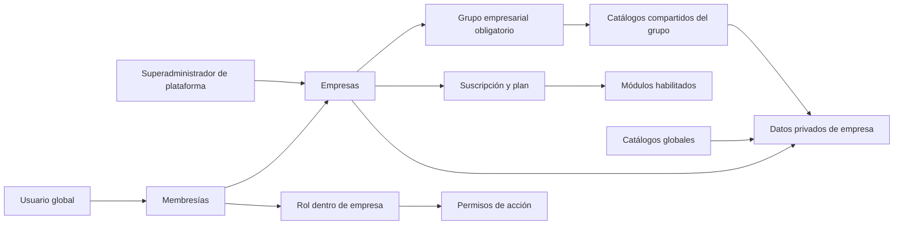

# Plan de trabajo multiempresa

## Propósito

Este documento define dirección, alcance, decisiones y orden de implementación para convertir Pixel Perfect en una plataforma SaaS multiempresa.

Debe usarse como contrato de contexto en futuras conversaciones. Cada fase debe completarse y verificarse antes de iniciar siguiente. No construir módulos nuevos sobre datos empresariales hasta comprobar aislamiento multiempresa.

## Último punto seguro de reanudación

Actualizado: 10 de septiembre de 2026.

- Última fase cerrada: **Fase 6 — Catálogos globales e híbridos**.
- Fase actual: **Fase 7 — Módulos, planes y límites**. Núcleo de módulos, habilitación empresarial y catálogo configurable de planes completados; asignación plan-módulo y enforcement de límites permanecen pendientes.
- Próximo bloque exacto: confirmar matriz plan-módulo, asignación de plan a empresa, cuotas medibles y precedencia de overrides. Catálogo permite capturar precio, límite opcional y módulos descriptivos sin aplicar reglas no confirmadas.
- `Puestos` y sus salarios fueron confirmados como datos propios de cada empresa, no como catálogo compartido por grupo.
- Una misma persona puede tener expedientes independientes en varias empresas; nombre de usuario, correo, CURP, RFC y NSS son únicos solamente dentro de cada empresa.
- Catálogo grupal o extensiones empresariales de tipos de documento quedan diferidos hasta confirmar necesidad real; no existe implementación híbrida accidental.
- Invitaciones empresariales continúan fuera de alcance porque contrato de incorporación no está confirmado.
- Superadministrador de plataforma tiene acceso directo explícito a todas empresas, incluso sin membresía; decisión confirmada por propietario el 5 de septiembre de 2026. Impersonación y auditoría detallada quedan para portal operativo.
- Migraciones nuevas fueron probadas con base limpia de testing. Falta ejecutar `php artisan migrate` en cada entorno real durante despliegue controlado.
- Advertencia local: durante verificación, `php artisan migrate:fresh --env=testing --force` apuntó a MySQL local y reconstruyó esa base. Esquema y datos semilla fueron restaurados con `migrate` + `db:seed`; datos locales anteriores, si existían, no pudieron recuperarse desde proyecto.

Verificación del corte:

- `composer ci:check`: **210 pruebas, 1562 aserciones, PHPStan, Pint, ESLint, Prettier y TypeScript correctos**.
- `npm run build`: **correcto**.
- Pruebas multiempresa nuevas: núcleo Empresa, Teams, roles/permisos por empresa, catálogos globales, módulos/entitlements, bindings cruzados, formularios manipulados, superadministrador global, reinicio de contexto y aislamiento de Puestos, salarios, Empleados, documentos, archivos, dashboard y exportación.

Implementación disponible:

- tablas `grupos_empresariales`, `empresas` y `membresias_empresa` con claves, índices y unicidad;
- enums de estado empresarial, membresía y tipo de grupo;
- flag no asignable desde UI `es_superadministrador_plataforma`;
- creación transaccional de empresa y grupo exclusivo, con opción de grupo existente;
- seeders idempotentes para grupo/empresa inicial Pixel Perfect y membresía del superadministrador;
- contexto request-scoped `EmpresaContext` y middleware `empresa.activa`;
- Teams de Spatie Permission mediante `empresa_id`, rol `Administrador` protegido por empresa y backfill del tenant inicial;
- rutas separadas `/admin/empresas` y `/app/{empresa:slug}`, incluyendo usuarios y roles empresariales;
- portal inicial de empresas con búsqueda, filtros y paginación;
- selector de empresa y props Inertia tipadas;
- usuario global con membresías y roles independientes; retirar usuario de empresa no elimina identidad global;
- superadministrador separado por flag, con bypass explícito no asignable desde UI empresarial;
- permisos de plataforma excluidos de roles empresariales;
- reinicio de contexto en cada request para evitar fuga de cache/permisos;
- Puestos y salarios aislados por empresa mediante rutas, bindings, policies, validación, consultas, dashboard, exportación y restricción única compuesta;
- Empleados y documentos aislados por empresa mediante claves foráneas compuestas, unicidades empresariales, rutas privadas, policies, validación, acciones transaccionales, activity log, dashboard y exportación;
- archivos nuevos de empleados almacenados bajo `empresas/{empresa_id}/empleados/{empleado_id}/...`; rutas heredadas permitidas solamente para empresa inicial;
- catálogo `Tipos de documento de empleados` clasificado como global: lectura empresarial para expedientes y administración/exportación exclusiva de plataforma;
- catálogo global de módulos con `usuarios`, `roles`, `puestos` y `empleados`, habilitación por empresa, middleware, navegación, dashboard, configuración de plataforma y activity log de overrides;
- deshabilitar módulo conserva datos y no sustituye permisos: empresa, módulo, permiso y pertenencia siguen siendo controles independientes.

## Visión del producto

Pixel Perfect será una sola plataforma centralizada, administrada por propietario del sistema, donde varias empresas podrán contratar acceso mensual.

Cada empresa tendrá:

- usuarios y membresías propias;
- roles y permisos propios;
- módulos habilitados según plan o acuerdo comercial;
- registros, empleados, archivos, configuraciones y paneles aislados;
- acceso solamente a funciones autorizadas dentro de módulos contratados.

Propietario de plataforma podrá:

- administrar empresas;
- activar, suspender o cancelar acceso;
- configurar planes, módulos y excepciones comerciales;
- consultar métricas globales;
- brindar soporte mediante accesos explícitos y auditados;
- administrar catálogos verdaderamente globales.

## Decisiones confirmadas

### Arquitectura

- Mantener monolito modular Laravel. No usar microservicios inicialmente.
- Usar una sola aplicación y una base de datos compartida inicialmente.
- Aislar datos empresariales por filas usando `empresa_id`.
- Toda empresa pertenece obligatoriamente a un solo grupo empresarial.
- Empresa independiente recibe grupo empresarial exclusivo con una sola empresa.
- Catálogos compartidos usan `grupo_empresarial_id`; registros operativos usan `empresa_id`.
- Mantener posibilidad futura de separar clientes especiales en otra base si requisitos legales o comerciales lo exigen.
- No depender solamente de permisos para aislar datos. Toda lectura y mutación debe estar limitada por empresa.
- Usar contexto empresarial explícito en rutas, preferentemente `/app/{empresa:slug}/...`.
- Mantener portal de plataforma separado, preferentemente `/admin/...`.

### Identidad y acceso

- `users` representa identidad global.
- Un usuario podrá pertenecer a una o varias empresas mediante membresías.
- Pertenecer a empresa dentro de grupo no concede acceso a otras empresas del mismo grupo.
- Grupo comparte catálogos autorizados, no empleados, usuarios, documentos ni registros operativos.
- Puestos y salarios pertenecen a empresa; empresas del mismo grupo no los comparten.
- Rol dentro de una empresa no otorga acceso a otras empresas.
- Separar completamente `Superadministrador de plataforma` y `Administrador de empresa`.
- Superadministrador de plataforma no será asignable desde UI empresarial.
- Superadministrador de plataforma accede directamente a cualquier empresa sin membresía durante MVP.
- Permisos describen acciones; membresía define empresa; plan define módulos disponibles.

### Reglas actuales conservadas

- Avatares de usuario continuarán almacenándose en binario por decisión de negocio.
- Todo empleado nuevo inicia con `2` días de vacaciones.
- Cálculo futuro actualizará días según antigüedad y reglas laborales aplicables.
- Documentos sensibles continuarán en almacenamiento privado.
- Wayfinder seguirá siendo fuente de rutas frontend.
- Inertia v3, React 19 y Tailwind CSS 4 continuarán como stack frontend.

## Estado actual de base

Fecha de referencia: 16 de agosto de 2026.

Base actual ya contiene:

- autenticación Fortify;
- verificación de correo;
- recuperación de contraseña;
- 2FA;
- rate limiting de autenticación;
- policies y permisos;
- protección de último administrador;
- validación mediante Form Requests;
- acciones transaccionales y locks;
- archivos privados y descargas autorizadas;
- compresión centralizada de imágenes;
- activity log;
- exportaciones PDF y Excel;
- componentes compartidos para tablas, filtros, formularios, archivados y paginación;
- loader y alertas globales;
- CI de GitHub Actions.

Verificación actual:

- 130 pruebas pasan;
- 886 aserciones pasan;
- PHPStan pasa;
- TypeScript pasa;
- ESLint pasa;
- Prettier pasa;
- Pint pasa;
- build de producción pasa.

## Problemas que impiden operar como SaaS

Sistema actual funciona como monoempresa. Antes de alojar segunda empresa deben resolverse estos puntos:

1. No existe modelo ni contexto `Empresa`.
2. Tablas empresariales no contienen `empresa_id`.
3. Roles y permisos funcionan globalmente.
4. Rol `Administrador` actual puede omitir todas las policies mediante `Gate::before()`.
5. Consultas, dashboard y reportes cuentan registros globales.
6. Restricciones únicas de empleados y catálogos aplican globalmente.
7. Archivos no incluyen empresa dentro de ruta de almacenamiento.
8. Activity log no guarda empresa explícita.
9. Jobs, cache, exportaciones e importaciones no transportan contexto empresarial.
10. Logs internos podrían convertirse accidentalmente en permiso empresarial.

Estos puntos son bloqueos de lanzamiento multiempresa, no defectos del funcionamiento monoempresa actual.

## Arquitectura objetivo



Autorización empresarial válida requiere simultáneamente:

```text
empresa activa
+ membresía activa
+ módulo habilitado
+ permiso asignado
+ registro perteneciente a empresa
```

Ocultar controles frontend mejora UX, pero servidor siempre debe comprobar cinco condiciones.

## Modelo de dominio preliminar

Nombres finales deberán seguir convenciones del proyecto. Estructura conceptual:

### `grupos_empresariales`

Responsabilidad: delimitar catálogos y configuraciones compartidas por una o varias empresas.

Reglas confirmadas:

- toda empresa pertenece exactamente a un grupo;
- grupo puede contener una o varias empresas;
- empresa sin relación corporativa recibe grupo exclusivo;
- lógica de lectura siempre usa grupo de empresa activa;
- usuario no selecciona grupo directamente;
- compartir grupo no comparte registros operativos;
- grupo no reemplaza membresía empresarial.

Campos candidatos:

- `id`;
- `nombre`;
- `slug` único;
- tipo informativo `individual` o `corporativo`, si aporta utilidad;
- estado;
- timestamps.

Empresa independiente y grupo exclusivo deben crearse dentro de misma transacción para evitar empresas sin grupo.

### `empresas`

Responsabilidad: tenant o cliente contratado.

Campos candidatos:

- `id`;
- `nombre_legal`;
- `nombre_comercial`;
- `slug` único;
- `grupo_empresarial_id` obligatorio e indexado;
- RFC y datos fiscales cuando facturación los requiera;
- correo y teléfono de contacto;
- zona horaria;
- moneda;
- estado comercial;
- `demo_ends_at` cuando aplique;
- fecha de activación;
- fecha de vencimiento;
- fecha de desactivación;
- fecha límite de retención antes de eliminación;
- configuración visual opcional;
- timestamps y soft deletes cuando reglas lo permitan.

Estados confirmados:

- `PROSPECTO`: empresa registrada comercialmente, sin acceso empresarial;
- `DEMO`: acceso temporal para evaluar sistema;
- `ACTIVA`: pago vigente y acceso habilitado;
- `VENCIDA`: pago vencido, sin acceso, datos retenidos durante periodo configurable;
- `DESACTIVADA`: sin acceso y pendiente de proceso controlado de eliminación o anonimización.

Transiciones confirmadas:

- `PROSPECTO` puede pasar a `DEMO` o `ACTIVA`;
- `DEMO` puede pasar a `ACTIVA` mediante contratación;
- `ACTIVA` pasa automáticamente a `VENCIDA` cuando se cumple condición de pago vencido;
- `VENCIDA` vuelve a `ACTIVA` cuando pago se regulariza;
- `VENCIDA` pasa automáticamente a `DESACTIVADA` al finalizar periodo de retención;
- `DESACTIVADA` permanece sin acceso y queda pendiente de proceso de eliminación.

Transición al vencer `DEMO`, duración de retención y eliminación definitiva permanecen pendientes.

### `membresias_empresa`

Responsabilidad: relación usuario-empresa.

Campos candidatos:

- `empresa_id`;
- `user_id`;
- estado de membresía;
- fecha de incorporación;
- fecha de suspensión;
- usuario que invitó;
- indicador de propietario empresarial si resulta necesario;
- timestamps.

Restricciones:

- combinación `empresa_id + user_id` única;
- usuario suspendido en empresa A puede conservar acceso a empresa B;
- eliminación de membresía no elimina identidad global automáticamente.

### `invitaciones_empresa`

Responsabilidad: incorporación segura de usuarios nuevos o existentes.

Debe incluir:

- empresa;
- correo normalizado;
- invitador;
- token seguro almacenado de forma no reversible cuando aplique;
- fecha de expiración;
- estado;
- rol inicial opcional;
- protección contra reutilización.

### Roles y permisos

- Permisos disponibles son globales y definidos por sistema.
- Roles empresariales pertenecen a empresa.
- Asignación de roles ocurre dentro de contexto empresarial activo.
- Spatie Permission Teams puede usar `empresa_id` como team key.
- Cambiar empresa activa debe actualizar resolver de permisos antes de ejecutar policies.
- Roles de plataforma deben permanecer fuera de administración empresarial.

### Módulos, planes y suscripciones

Entidades candidatas:

- `modulos`;
- `planes`;
- `modulo_plan`;
- `suscripciones`;
- `empresa_modulo` para excepciones u overrides auditados;
- eventos de webhook procesados para idempotencia.

Reglas:

- plan habilita módulos para empresa;
- permiso habilita acción para usuario;
- tener permiso no habilita módulo no contratado;
- contratar módulo no concede automáticamente permisos;
- suscripción pertenece a empresa, no a usuario individual.
- proveedor de cobro elegido: Stripe mediante Laravel Cashier;
- empresa es modelo facturable de Cashier; usuarios individuales no reciben columnas ni suscripciones Stripe;
- catálogo de planes es global, exclusivo del superadministrador y conserva archivados;
- plan configura nombre, precio mensual MXN, color, icono, descripción libre de módulos, límite opcional de usuarios y días de gracia;
- no existe prueba gratuita; periodo de gracia inicial es 15 días y puede configurarse por plan;
- estado empresarial será estado normalizado interno, no copia directa de estado Stripe;
- webhooks Stripe actualizarán suscripción y solicitarán transiciones idempotentes;
- facturación fiscal se investigará cerca de preproducción.

## Clasificación de datos

### Globales

- identidades `users`;
- nombres y definiciones de permisos;
- módulos disponibles;
- planes comerciales;
- configuración de plataforma;
- catálogos globales sin relación con empresa ni grupo.

### Propios de empresa

- membresías;
- invitaciones;
- roles;
- empleados;
- puestos y salarios del catálogo laboral;
- documentos;
- preferencias empresariales;
- flujos internos;
- auditoría empresarial;
- consumo y límites.

### Compartidos por grupo empresarial

- catálogos cuyo contenido debe ser idéntico para empresas relacionadas;
- configuraciones operativas comunes expresamente clasificadas;
- entradas personalizadas visibles solamente para empresas del grupo propietario.

Cada tabla de catálogo compartido debe tener `grupo_empresarial_id` obligatorio. Empresa independiente usa grupo exclusivo, evitando condiciones especiales o `empresa_id` nullable.

Pertenecer al mismo grupo sólo concede visibilidad de catálogos expresamente clasificados como grupales. Puestos y salarios quedan excluidos. Permiso para editar contenido compartido requiere regla separada, porque cambio afecta varias empresas.

### Híbridos global-grupo

Requieren definición global más configuración de grupo:

- tipos de documento;
- plantillas de roles;
- requisitos documentales;
- catálogos estándar que acepten entradas personalizadas.

Ejemplo para tipos de documento:

- definición global: nombre, categoría, extensiones permitidas;
- configuración de grupo: activo, obligatorio, renovable, frecuencia;
- entrada personalizada: visible solamente dentro de grupo propietario.

No crear motor genérico para todos los catálogos. Clasificar cada catálogo según reglas reales. Catálogo completamente global no debe contener `grupo_empresarial_id`. Catálogo de grupo sí debe exigirlo.

## Reglas técnicas obligatorias de aislamiento

Toda tabla de datos propios de empresa debe cumplir puntos aplicables:

- `empresa_id` obligatorio e indexado;
- foreign key con comportamiento de borrado definido;
- restricciones únicas compuestas por empresa;
- queries limitadas por contexto empresarial;
- policy comprueba membresía, permiso y pertenencia del registro;
- route model binding no puede resolver registros de otra empresa;
- relaciones hijas usan scoped bindings;
- exportaciones usan mismas restricciones que listado;
- dashboard calcula solamente datos visibles;
- archivos usan prefijo `empresas/{empresa_id}/...`;
- cache incluye `empresa_id` dentro de clave;
- jobs transportan `empresa_id` y reconstruyen contexto;
- activity log registra `empresa_id`, actor y sujeto;
- errores no revelan existencia de registros ajenos;
- operaciones globales requieren servicio de plataforma explícito y auditado.

Toda tabla de catálogo grupal debe aplicar reglas equivalentes usando `grupo_empresarial_id`. Contexto grupal siempre se deriva de empresa activa; nunca llega confiado desde formulario ni se elige directamente por usuario.

Global scope puede usarse para aislamiento universal. Bypass debe ser explícito, limitado a servicios de plataforma y cubierto por pruebas.

## Plan por fases

### Fase 0 — Contrato de negocio

Estado: parcialmente completada el 16 de agosto de 2026.

Objetivo: cerrar decisiones que afectan datos y compatibilidad.

Confirmado:

- [x] un usuario puede pertenecer a una o varias empresas mediante membresías independientes;
- [x] solamente el superadministrador de plataforma crea empresas;
- [x] cada empresa pertenece obligatoriamente a un grupo empresarial;
- [x] una empresa independiente recibe un grupo exclusivo para conservar una sola lógica;
- [x] existen catálogos globales y catálogos compartidos por grupo empresarial;
- [x] compartir grupo no comparte usuarios, empleados ni datos operativos;
- [x] estados empresariales: `PROSPECTO`, `DEMO`, `ACTIVA`, `VENCIDA` y `DESACTIVADA`;
- [x] `VENCIDA` bloquea acceso de usuarios, pero conserva toda la información durante retención;
- [x] vencimiento de pago cambia automáticamente de `ACTIVA` a `VENCIDA`;
- [x] pago o reactivación válida permite volver de `VENCIDA` a `ACTIVA`;
- [x] al terminar retención, `VENCIDA` cambia automáticamente a `DESACTIVADA`;
- [x] `DESACTIVADA` queda pendiente de proceso controlado de eliminación o anonimización;
- [x] cobro previsto con Stripe mediante Laravel Cashier;
- [x] facturación fiscal se investigará cerca de preproducción.

Pendiente de confirmar:

- [ ] duración de cuenta `DEMO`;
- [ ] transición exacta al vencer `DEMO`;
- [ ] cantidad de meses de retención en `VENCIDA`;
- [ ] proceso, respaldos y autorización para eliminación o anonimización después de `DESACTIVADA`;
- [ ] quién puede modificar catálogos compartidos por grupo empresarial;
- [ ] si una empresa puede cambiar de grupo y cómo migrar sus catálogos;
- [ ] límites de cada plan;
- [ ] mecanismo de acceso de soporte.

Recomendación no confirmada:

- catálogos globales editables solamente desde portal de plataforma;
- durante MVP, catálogos grupales editables por superadministrador; delegación futura mediante permiso explícito de grupo, nunca implícita por ser administrador de una empresa;
- al vencer `DEMO`, volver a `PROSPECTO` con acceso bloqueado y conservar datos durante plazo configurable; si `PROSPECTO` debe significar únicamente “antes del demo”, agregar estado específico en vez de reutilizar `VENCIDA`;
- retención definida mediante configuración o plan, no número fijo en código;
- `DESACTIVADA` crea solicitud de eliminación auditada; no borra automáticamente sin plazo, respaldo y autorización explícitos.

Criterio de salida:

- ninguna regla persistente importante permanece como `No verificable` para fases 2 a 4.

### Fase 1 — Base verde

Estado: completada el 16 de agosto de 2026.

Completado:

- [x] actualizar pruebas de 21 a 23 permisos;
- [x] confirmar mediante prueba regla de 2 días iniciales de vacaciones;
- [x] agregar paginación multipágina para usuarios;
- [x] agregar paginación multipágina para roles;
- [x] agregar paginación multipágina para puestos;
- [x] agregar paginación multipágina para tipos de documento;
- [x] agregar paginación multipágina para empleados;
- [x] verificar conservación de búsqueda, filtros, `per_page` y `page`;
- [x] reforzar CI con instalaciones reproducibles y build;
- [x] ejecutar suite y controles completos.

Criterio de salida alcanzado:

- suite, análisis estático, frontend y build verdes.

### Fase 2 — Núcleo Empresa y contexto activo

Estado: completada el 4 de septiembre de 2026.

Objetivo: introducir frontera empresarial sin migrar todavía todos los módulos.

Alcance:

- modelo, migración, factory y seeder de grupo empresarial;
- modelo, migración, factory y seeder de empresa;
- relación obligatoria de cada empresa con un grupo empresarial;
- creación transaccional de empresa y grupo exclusivo cuando no se elija un grupo existente;
- alta de empresas reservada al superadministrador de plataforma;
- membresías empresa-usuario;
- invitaciones si contrato queda confirmado;
- empresa inicial Pixel Perfect;
- resolver empresa desde ruta;
- middleware de empresa activa;
- comprobar membresía activa;
- compartir empresa y empresas disponibles mediante Inertia;
- compartir grupo derivado de empresa activa, sin selector de grupo;
- selector de empresa;
- rutas empresariales y portal de plataforma separados;
- estados vacío, suspendido, sin membresía y empresa inexistente.

Pruebas mínimas:

- ninguna empresa puede existir sin grupo;
- empresa independiente recibe grupo exclusivo;
- varias empresas pueden pertenecer al mismo grupo;
- solamente superadministrador de plataforma crea empresas;
- usuario miembro accede;
- usuario ajeno recibe 404 o 403 según contrato;
- membresía en una empresa no concede acceso a otra empresa del mismo grupo;
- membresía suspendida no accede;
- usuario con varias empresas puede cambiar contexto;
- URL conserva empresa correcta;
- empresa inactiva aplica comportamiento definido;
- props Inertia no exponen empresas ajenas.

Criterio de salida:

- contexto empresarial estable y probado, todavía sin confiar en él para todos los datos existentes.

Resultado:

- [x] modelos, migraciones, factories y seeders de grupo, empresa y membresía;
- [x] relación obligatoria empresa-grupo y alta transaccional de grupo exclusivo;
- [x] alta de empresas reservada al superadministrador de plataforma;
- [x] empresa inicial Pixel Perfect y membresía inicial idempotentes;
- [x] resolución por `{empresa:slug}` y contexto request-scoped;
- [x] membresía activa y estado empresarial comprobados por middleware;
- [x] empresa, grupo derivado y empresas disponibles compartidos mediante Inertia;
- [x] selector de empresa y portal de plataforma separados;
- [x] respuestas probadas para empresa inexistente, usuario ajeno, membresía suspendida, empresa vencida y demo expirada;
- [x] aislamiento probado entre empresas del mismo grupo;
- [ ] invitaciones: `No verificable`; contrato pendiente, por tanto no forman parte del cierre técnico de esta fase.

Límite intencional al cerrar Fase 2: rutas de usuarios, roles, puestos, tipos de documento, empleados y reportes permanecían monoempresa. Usuarios y roles fueron migrados en Fase 3; módulos restantes están cercados a empresa inicial y no se exponen a otro tenant.

### Fase 3 — Autorización por empresa

Estado: completada el 5 de septiembre de 2026.

Objetivo: separar privilegios de plataforma y empresa.

Alcance:

- activar Teams de Spatie Permission;
- usar `empresa_id` como identificador de team;
- migrar roles existentes;
- crear rol empresarial protegido;
- crear identidad o rol de superadministrador de plataforma;
- reemplazar bypass global actual;
- impedir que administrador empresarial asigne permisos de plataforma;
- invalidar cache de permisos al cambiar empresa;
- adaptar props Inertia y navegación.

Pruebas mínimas:

- mismo usuario puede tener roles distintos en empresas distintas;
- administrador de empresa A no administra B;
- superadministrador entra por portal de plataforma;
- usuario no puede cambiar team id desde cliente;
- roles protegidos no se renombran ni eliminan;
- última administración empresarial no puede eliminarse si regla lo exige;
- permisos mostrados coinciden con contexto activo.

Criterio de salida:

- ninguna policy empresarial depende de rol global `Administrador`.

Resultado:

- [x] Teams de Spatie Permission activado con `empresa_id`;
- [x] rol modelo propio y roles `Administrador` protegidos por empresa;
- [x] migración compatible para instalaciones existentes y frescas;
- [x] roles, asignaciones y usuarios existentes trasladados a empresa inicial mediante backfill;
- [x] administración de usuarios y roles movida a `/app/{empresa:slug}/...` con scoped bindings;
- [x] listados, validación de IDs, mutaciones y redirecciones limitados a empresa activa;
- [x] administrador de empresa no puede conceder permisos de plataforma ni operar otra empresa;
- [x] retiro de usuario elimina membresía/roles empresariales, no identidad global;
- [x] último administrador protegido por empresa, incluso al eliminar perfil global;
- [x] contexto de permisos y relaciones reiniciado en cada request;
- [x] props Inertia y navegación responden a empresa activa;
- [x] superadministrador de plataforma separado por flag, acceso global explícito y wildcard frontend;
- [x] módulos no migrados cercados a empresa inicial para impedir exposición accidental;
- [x] criterio de salida alcanzado: ninguna policy empresarial depende de rol global `Administrador`.

Pendiente fuera del cierre:

- [ ] invitación o incorporación de identidad global ya existente a otra empresa: `No verificable`;
- [ ] bitácora e impersonación opcional para sesiones de soporte: se implementarán en Fase 9.

### Fase 4 — Piloto de catálogo empresarial: Puestos

Estado: completada el 8 de septiembre de 2026.

Decisión confirmada: cada empresa crea y administra su propio catálogo de Puestos y sus salarios. Empresas del mismo grupo no comparten este catálogo.

Objetivo: validar aislamiento empresarial con un módulo simple antes de migrar Empleados. Piloto de catálogo grupal se difiere hasta identificar un catálogo realmente compartido.

Alcance:

- agregar `empresa_id` obligatorio al catálogo piloto;
- asignar registros existentes a empresa inicial Pixel Perfect;
- cambiar nombre único global a único por empresa;
- aplicar scope por empresa activa;
- adaptar routes, binding, policy, requests, controller, reportes y UI;
- preservar filtros, archivado y paginación;
- adaptar factory y seeder;
- mantener redirecciones dentro de empresa activa;
- permitir modificación según permisos empresariales existentes.

Pruebas mínimas:

- empresas del mismo grupo mantienen registros y salarios separados;
- empresas distintas pueden tener puestos con mismo nombre y salarios diferentes;
- usuario de empresa A no lista, actualiza, elimina ni restaura registros de empresa B;
- IDs y `empresa_id` manipulados no cruzan empresa;
- búsqueda, filtro, archivado, exportación y paginación permanecen aislados por empresa;
- dashboard cuenta registros visibles para empresa activa;
- superadministrador usa acceso global solamente desde flujo explícito.

Criterio de salida:

- patrón queda aprobado como referencia para catálogos propios de empresa.

Resultado:

- [x] columna `empresa_id` obligatoria, foreign key restrictiva e índice único `empresa_id + nombre`;
- [x] backfill de puestos existentes a empresa inicial Pixel Perfect mediante migración separada;
- [x] relación Empresa-Puestos y factory válida;
- [x] rutas movidas a `/app/{empresa:slug}/puestos` con scoped bindings, archivado y restauración;
- [x] listado, CRUD, policy, Form Requests y redirecciones limitados a empresa activa;
- [x] navegación y Wayfinder adaptados para cualquier empresa;
- [x] dashboard empresarial cuenta solamente puestos activos propios;
- [x] exportación empresarial incluye solamente puestos propios;
- [x] importador legado asigna puestos a empresa inicial y resuelve nombres dentro de esa empresa;
- [x] Empleados todavía cercados a empresa inicial solamente pueden seleccionar puestos de esa empresa;
- [x] pruebas cruzadas cubren empresas del mismo grupo, mismo nombre, salarios distintos, IDs manipulados, falta de permiso, dashboard y exportación;
- [x] `composer ci:check`: 180 pruebas, 1292 aserciones y todos los controles correctos;
- [x] `npm run build`: correcto.

### Fase 5 — Empleados y documentos

Estado: completada el 10 de septiembre de 2026.

Decisión confirmada: una persona puede tener expedientes independientes en varias empresas. `nombre_usuario`, correo, CURP, RFC y NSS pueden repetirse entre empresas, pero son únicos dentro de una misma empresa.

Límite intencional: `Tipos de documento de empleados` conserva comportamiento global existente como catálogo de lectura para expedientes. Propiedad y gobierno de edición no cambian en esta fase; clasificación definitiva corresponde a Fase 6.

Objetivo: aplicar patrón tenant al dominio sensible y complejo.

Alcance:

- [x] agregar `empresa_id` obligatorio a empleados mediante migración escalonada y backfill;
- [x] convertir unicidades de usuario, correo, CURP, RFC y NSS a alcance empresarial;
- [x] asociar documentos a empresa y reforzar empleado-puesto-documento con claves foráneas compuestas;
- [x] validar puesto dentro de empresa activa;
- [x] conservar tipos de documento globales visibles para empresas sin anticipar clasificación de Fase 6;
- [x] guardar archivos nuevos en `empresas/{empresa_id}/empleados/{empleado_id}/...` y limitar compatibilidad heredada a empresa inicial;
- [x] adaptar preview y descarga con bindings y comprobaciones de empresa, empleado, documento y ruta;
- [x] adaptar acciones transaccionales, locks, rollback de archivos, reemplazo y restauración;
- [x] adaptar reportes, dashboard, navegación y Wayfinder;
- [x] agregar `empresa_id` al activity log y backfill de actividades empresariales existentes;
- [x] conservar regla de 2 días iniciales.

Pruebas mínimas:

- [x] los cinco identificadores pueden repetirse entre empresas;
- [x] cada identificador duplicado dentro de misma empresa falla en validación y base de datos;
- [x] puesto ajeno falla en validación y clave foránea compuesta;
- [x] tipo inactivo o archivado no puede asignarse como documento nuevo; tipo ajeno no aplica mientras catálogo sea global;
- [x] documento ajeno no puede verse ni descargarse;
- [x] archivos nuevos quedan bajo prefijo empresarial;
- [x] rollback limpia archivos nuevos y reemplazo elimina archivo anterior correcto;
- [x] exportación y dashboard no mezclan empresas;
- [x] restauración respeta empresa y prerequisitos del puesto;
- [x] lock transaccional más índice único impiden documentos duplicados por empleado y tipo;
- [x] `composer ci:check`: 194 pruebas, 1350 aserciones y todos los controles correctos;
- [x] `npm run build`: correcto.

Criterio de salida:

- módulo sensible queda aislado extremo a extremo.

### Fase 6 — Catálogos globales e híbridos

Estado: completada el 10 de septiembre de 2026.

Clasificación aplicada:

- `Puestos` y salarios: propiedad empresarial; nombre y montos independientes por empresa.
- `Roles`: propiedad empresarial; mismo nombre permitido entre empresas.
- `Tipos de documento de empleados`: definición global propiedad de plataforma; empresas consumen catálogo desde expedientes sin modificarlo.
- extensiones empresariales, catálogos grupales y overrides de tipos de documento: `No verificable`; no implementados hasta confirmar reglas.

Objetivo: permitir configuración común sin perder autonomía empresarial.

Alcance:

- [x] clasificar cada catálogo existente con propietario explícito;
- [x] separar administración global de consumo empresarial;
- [x] impedir entradas empresariales no autorizadas;
- [x] conservar referencias históricas al desactivar tipos usados;
- [x] mantener activación, archivado, restauración y restricción de eliminación en uso;
- [x] mover administración, reporte y navegación a `/admin`, visibles sólo para plataforma.

Pruebas mínimas:

- [x] empresas distintas ven mismo catálogo global permitido desde Empleados;
- [x] empresa no modifica, restaura, elimina ni exporta definición global, incluso con permisos heredados manipulados;
- [x] permisos globales heredados quedan fuera de roles empresariales y formularios de asignación;
- [x] entradas empresariales personalizadas no aplican mientras contrato sea `No verificable`;
- [x] documentos históricos sobreviven desactivación y conservan relación;
- [x] cambios globales quedan en activity log sin `empresa_id`;
- [x] `composer ci:check`: 199 pruebas, 1423 aserciones y todos los controles correctos al cierre de Fase 6;
- [x] `npm run build`: correcto.

Criterio de salida:

- cada catálogo tiene propietario y reglas explícitas.

### Fase 7 — Módulos, planes y límites

Estado: en curso. Núcleo de módulos y catálogo configurable de planes completados el 10 de septiembre de 2026; asignación comercial y cuotas efectivas pendientes.

Decisión segura aplicada: módulos existentes se habilitan por defecto para conservar compatibilidad. Plataforma puede deshabilitarlos por empresa. Deshabilitar acceso nunca elimina registros. Precio y presentación se administran en catálogo; límite de usuarios queda nullable y sin enforcement hasta definir cifra. Relación técnica plan-módulo sigue `No verificable`; texto de módulos es descriptivo y no concede acceso.

Objetivo: controlar qué sistemas puede usar cada empresa.

Alcance:

- [x] catálogo global de módulos `usuarios`, `roles`, `puestos` y `empleados`;
- [x] catálogo global de planes exclusivo del superadministrador, con CRUD, archivado, búsqueda, filtros y paginación;
- [x] nombre, precio mensual MXN, color AntD, 20 iconos AntD, módulos descriptivos, límite opcional, gracia y estado activo;
- [ ] relación plan-módulo — depende de planes confirmados;
- [x] módulos habilitados por empresa con backfill y alta automática de empresas nuevas;
- [x] overrides empresariales auditados con actor, empresa, estado anterior y nuevo;
- [~] límite opcional de usuarios persistido por plan; cifra y enforcement no confirmados. Empleados, almacenamiento y operaciones siguen sin cuota;
- [x] middleware de entitlement en CRUD, archivos y exportaciones;
- [x] navegación basada en módulo y permiso;
- [~] pantalla empresarial muestra módulos habilitados; asignación de plan y consumo esperan contrato comercial;
- [x] pantalla de plataforma configura módulos por empresa.
- [x] pantalla de plataforma administra planes y estados archivados.

Pruebas mínimas:

- [x] permiso sin módulo habilitado no concede acceso;
- [x] módulo habilitado sin permiso no concede acción;
- [x] módulo desactivado desaparece de navegación y falla en servidor;
- [x] override afecta sólo empresa objetivo;
- [ ] límites resisten solicitudes concurrentes — existe campo configurable, pero no cuota efectiva confirmada;
- [x] deshabilitación no corrompe ni elimina datos existentes;
- [x] seeders son idempotentes y no revierten overrides ni desactivación global;
- [x] catálogo de planes restringido a superadministrador, validado, normalizado y auditado;
- [x] `composer ci:check`: 210 pruebas, 1562 aserciones y todos los controles correctos;
- [x] `npm run build`: correcto.

Criterio de salida:

- módulos y permisos funcionan como controles independientes.

### Fase 8 — Suscripciones y cobro mensual

Estado: base técnica preparada; automatización de cobro pendiente.

Objetivo: automatizar ciclo comercial.

Proveedor confirmado: Stripe mediante Laravel Cashier v16.8. Cashier está instalado, empresa es entidad facturable, migraciones usan `empresa_id`, moneda predeterminada es MXN y locale `es_MX`. No existen llamadas a Stripe, productos, precios, checkout ni webhooks activos. Facturación fiscal y reglas comerciales finales siguen pendientes.

Alcance:

- [x] empresa como entidad facturable;
- estado interno normalizado, independiente de nombres propios de Stripe;
- alta de suscripción;
- [x] sin prueba gratuita, decisión confirmada;
- pagos recurrentes;
- cambio de plan;
- cancelación y reactivación;
- [~] periodo de gracia configurable por plan, predeterminado en 15 días; transición automática pendiente;
- facturas y portal de pago;
- webhooks firmados;
- procesamiento idempotente;
- transición automática `ACTIVA` a `VENCIDA` al cumplirse condición de impago;
- reactivación `VENCIDA` a `ACTIVA` después de pago válido;
- transición programada `VENCIDA` a `DESACTIVADA` al terminar retención;
- historial y auditoría;
- notificaciones de pago;
- overrides administrativos.

Pruebas mínimas:

- webhook válido se procesa una vez;
- webhook inválido se rechaza;
- eventos repetidos no duplican efectos;
- pago activa acceso correcto;
- vencimiento aplica política definida;
- cancelación respeta periodo contratado;
- reactivación restaura entitlements;
- fallos externos pueden reintentarse.

Criterio de salida:

- estado comercial y acceso permanecen sincronizados y auditables.

### Fase 9 — Portal de plataforma y operación SaaS

Estado: pendiente.

Objetivo: operar varias empresas con seguridad y visibilidad.

Funciones para plataforma:

- listado y detalle de empresas;
- plan, módulos y estado de pago;
- usuarios y membresías;
- consumo y almacenamiento;
- última actividad;
- activar, suspender y reactivar;
- métricas agregadas;
- soporte temporal auditado;
- historial de cambios comerciales.

Funciones para empresas:

- selector de empresa;
- miembros e invitaciones;
- roles;
- plan y módulos;
- consumo y límites;
- auditoría propia;
- avisos operativos;
- contacto de soporte.

Operación técnica:

- base MySQL o PostgreSQL administrada;
- Redis para cache, sesiones y colas;
- workers supervisados;
- scheduler activo;
- object storage privado;
- backups automáticos;
- restauraciones probadas;
- monitoreo y alertas;
- antivirus o cuarentena para documentos;
- rate limiting para exportaciones y descargas;
- rotación y protección de secretos;
- MFA obligatoria para cuentas privilegiadas;
- proceso de respuesta a incidentes.

Criterio de salida:

- plataforma puede operarse y recuperarse sin intervención manual improvisada.

## Migración de datos actuales

Cuando núcleo multiempresa exista:

1. Crear empresa inicial `Pixel Perfect`.
2. Asignar usuario administrador actual como superadministrador y miembro empresarial según contrato.
3. Asignar usuarios actuales mediante membresías.
4. Asignar roles actuales a empresa inicial o convertirlos en plantillas cuando corresponda.
5. Asignar puestos, empleados, documentos y configuraciones actuales a empresa inicial.
6. Cambiar restricciones únicas después de backfill correcto.
7. Agregar claves foráneas e índices después de reconciliar datos.
8. Reconciliar conteos antes y después.
9. Probar muestras y registros archivados.
10. Mantener importador legado consciente de empresa destino.

Migración debe ser repetible o proteger contra duplicados. Ningún registro sin empresa puede quedar en tablas tenant.

## Definition of Done para todo módulo tenant

Módulo multiempresa queda completo solamente cuando:

- contrato identifica actor, empresa, acciones y datos;
- tabla tiene `empresa_id`, índices y restricciones correctas;
- relaciones no aceptan IDs de otra empresa;
- listado, detalle y mutaciones usan contexto empresarial;
- policy comprueba permiso y pertenencia;
- rutas usan empresa y scoped binding;
- Form Requests normalizan y validan dentro de empresa;
- acciones y transacciones conservan empresa;
- archivos usan almacenamiento empresarial privado;
- cache y jobs incluyen empresa;
- activity log incluye empresa;
- reportes y dashboard quedan aislados;
- frontend recibe empresa activa y permisos correctos;
- navegación depende de módulo y permiso;
- estados loading, vacío, error, suspendido y sin permiso funcionan;
- filtros y paginación conservan URL;
- pruebas cruzadas A/B pasan;
- PHPUnit afectado pasa;
- Pint pasa;
- PHPStan pasa;
- TypeScript, ESLint y Prettier pasan cuando frontend cambia;
- build pasa cuando frontend, rutas o assets cambian;
- CI completa pasa.

## Matriz mínima de aislamiento

Cada recurso tenant deberá probar:

| Operación | Misma empresa | Otra empresa | Sin permiso | Empresa suspendida |
| --- | --- | --- | --- | --- |
| Listar | Permitido | No aparece | 403 | Según contrato |
| Ver | Permitido | 404/403 | 403 | Según contrato |
| Crear | Permitido | N/A | 403 | Bloqueado |
| Actualizar | Permitido | 404/403 | 403 | Bloqueado |
| Eliminar | Permitido | 404/403 | 403 | Bloqueado |
| Restaurar | Permitido | 404/403 | 403 | Bloqueado |
| Exportar | Sólo datos propios | Sin datos ajenos | 403 | Según contrato |
| Descargar archivo | Permitido | 404 | 403 | Según contrato |

Usar preferentemente 404 para ocultar existencia de recurso ajeno cuando contrato de seguridad lo determine.

## Riesgos principales

### Fuga entre empresas

Mitigación:

- scope universal;
- policies;
- scoped bindings;
- claves foráneas compuestas cuando aporten defensa adicional;
- pruebas cruzadas por cada operación.

### Confusión entre módulo y permiso

Mitigación:

- servicios separados;
- middleware separado;
- pruebas donde solamente una condición está presente.

### Bypass de superadministrador demasiado amplio

Mitigación:

- portal separado;
- acceso explícito;
- auditoría;
- nunca reutilizar administrador empresarial.

### Jobs y cache sin contexto

Mitigación:

- transportar `empresa_id` explícitamente;
- reconstruir contexto al ejecutar;
- incluir empresa en claves;
- pruebas de jobs para dos empresas.

### Archivos sensibles

Mitigación:

- disco privado;
- prefijo empresarial;
- autorización por empresa;
- nombres generados;
- validación MIME, extensión y tamaño;
- compresión centralizada para imágenes;
- análisis antimalware futuro;
- auditoría de descargas cuando sea necesario.

### Migración incompleta

Mitigación:

- backfill antes de hacer campo obligatorio;
- conteos;
- muestras;
- rollback o migración correctiva;
- respaldo probado.

## Decisiones pendientes

Marcar como `No verificable` hasta confirmación:

- facturación fiscal requerida;
- duración de cuenta `DEMO`;
- transición exacta al vencer `DEMO`;
- límites de cada plan;
- cantidad exacta de meses de retención en `VENCIDA`;
- eliminación, anonimización y respaldo después de `DESACTIVADA`;
- gobierno de edición para catálogos compartidos por grupo;
- reglas para mover una empresa entre grupos;
- impersonación o sesión delegada opcional para soporte; acceso directo del superadministrador ya está confirmado;
- clasificación definitiva de cada catálogo restante como global, grupal o empresarial; Puestos ya fue confirmado como empresarial;
- posibilidad de subdominios personalizados;
- necesidad futura de base separada para clientes empresariales;

## Orden recomendado inmediato

1. Cerrar decisiones de Fase 0 necesarias para núcleo.
2. Implementar Fase 2: Empresa, membresía y contexto.
3. Implementar Fase 3: roles y permisos empresariales.
4. Convertir Puestos como catálogo empresarial piloto y ejecutar pruebas cruzadas.
5. Confirmar gobierno y primer catálogo realmente grupal antes de implementar compartición.
6. Convertir Empleados y documentos.
7. Clasificar y convertir catálogos.
8. Construir módulos nuevos usando patrón aprobado.
9. Añadir planes y entitlements.
10. Integrar Stripe con Cashier cuando reglas comerciales finales estén confirmadas.

## Cómo continuar en futuras conversaciones

Prompt recomendado:

```text
Lee PLAN_MULTIEMPRESA.md y AGENTS.md. Quiero trabajar únicamente en la Fase X.
Primero audita estado actual contra criterios de esa fase, enumera decisiones No verificable,
y después implementa solamente alcance confirmado. No avances a fase siguiente.
Ejecuta pruebas y Definition of Done aplicable antes de terminar.
```

Al terminar cada fase:

1. actualizar estado dentro de este documento;
2. marcar tareas completadas;
3. registrar decisiones confirmadas;
4. registrar cambios de alcance;
5. actualizar resultados de verificación;
6. indicar próxima fase segura.
